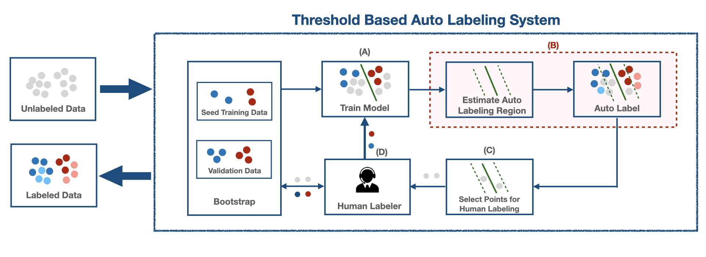

# Threshold-based Auto-labeling (TBAL)



This repository provides code for the experiments in our paper,

**Promises and Pitfalls of Threshold-based Auto-labeling**, NeurIPS 2023 (Spotlight)  
*Harit Vishwakarma, Heguang Lin, Frederic Sala, Ramya Korlakai Vinayak*


**TL;DR:** In this work we analyze threshold-based auto-labeling (TBAL) that is getting widely used in practice for data labeling. Our work provides insights on when machine-labeled data obtained through TBAL can be relied on.

**Keywords:** Auto Labeling, Active Learning, Selective Classification

**Paper URL:**  https://openreview.net/pdf?id=RUCFAKNDb2

# Instructions to run code
First things first, lets create the conda environment as follows,
## Environment 

We recommend you create a conda environment as follows.

```
conda env create -f environment.yml
```

and activate it with

```
conda activate tbal
```

Now lets run some examples,
## Sample Usage
To get started we recommend running the notebook `scripts/examples/unit_ball_tbal_test.ipynb` and other example notebooks in the same directory. This notebook runs the TBAL workflow with the options specified in the config file `configs/unit-ball/unit_ball_base_conf.yaml`. Please see `configs/example_config.yaml` for the usage of  options.

## Citation

If you find our repository useful for your research, please consider citing our paper:
```
@inproceedings{ vishwakarma2023promises,
title={Promises and Pitfalls of Threshold-based Auto-labeling},
author={Harit Vishwakarma and Heguang Lin and Frederic Sala and Ramya Korlakai Vinayak},
booktitle={Thirty-seventh Conference on Neural Information Processing Systems},
year={2023},
url={https://openreview.net/forum?id=RUCFAKNDb2}
}
```